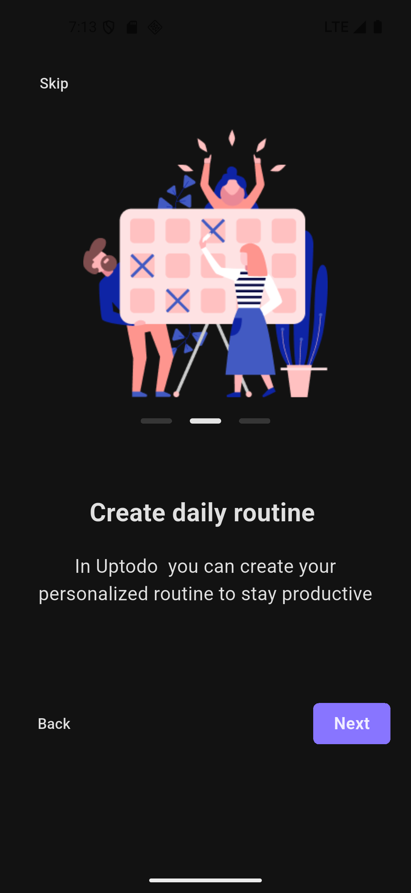
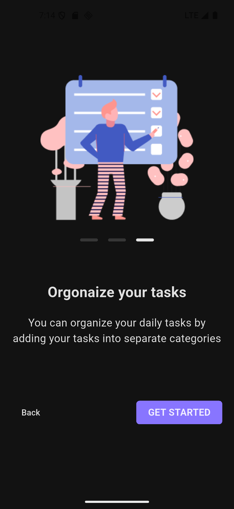
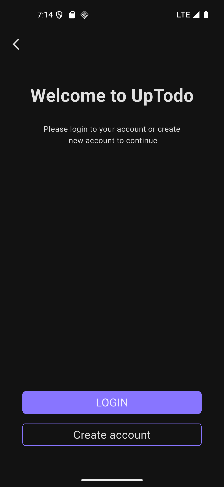
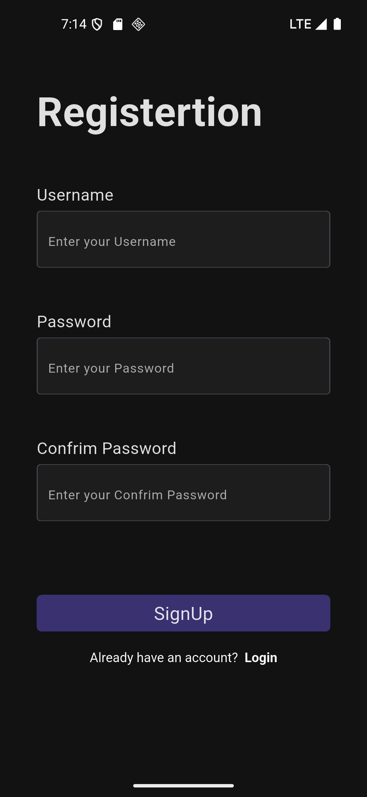
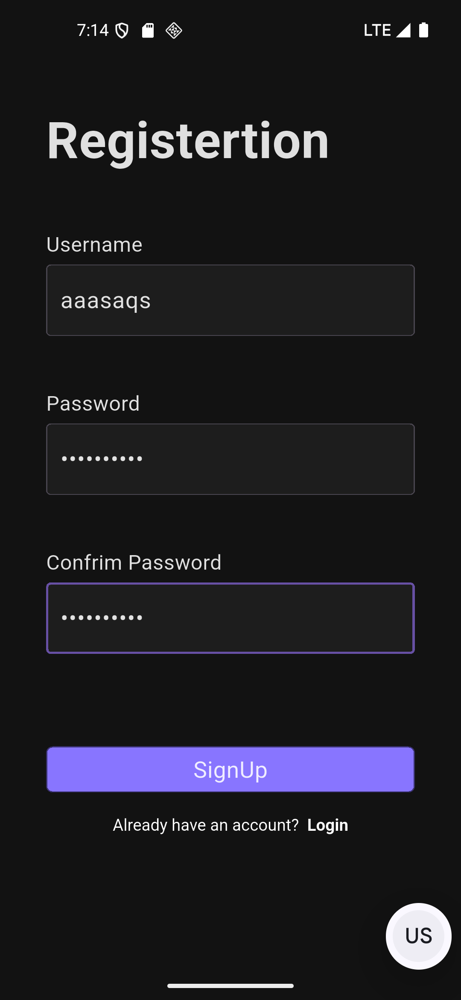
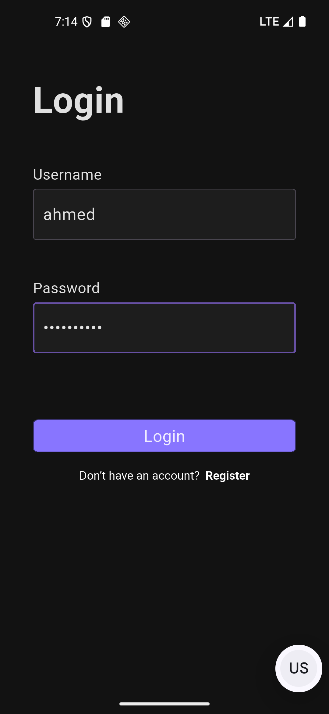
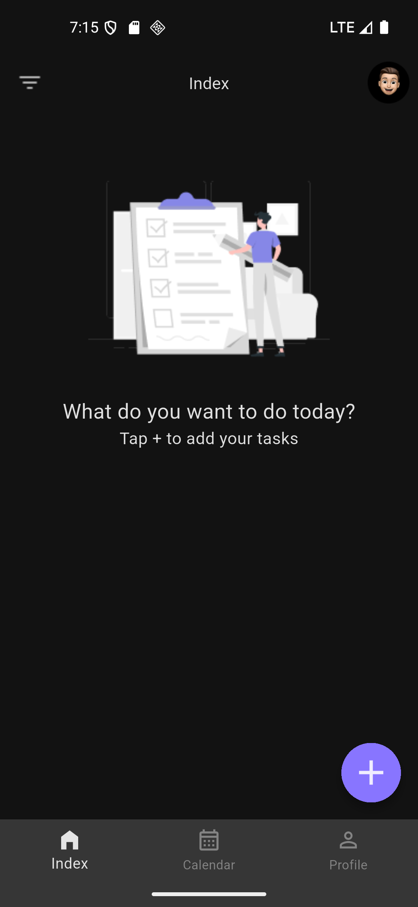
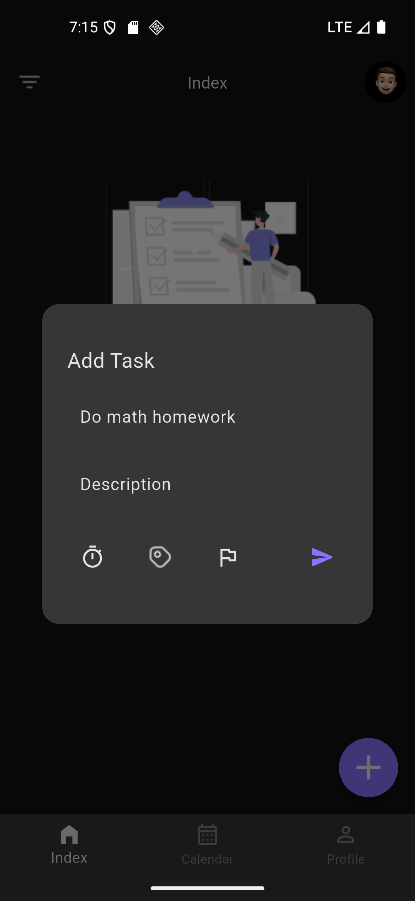
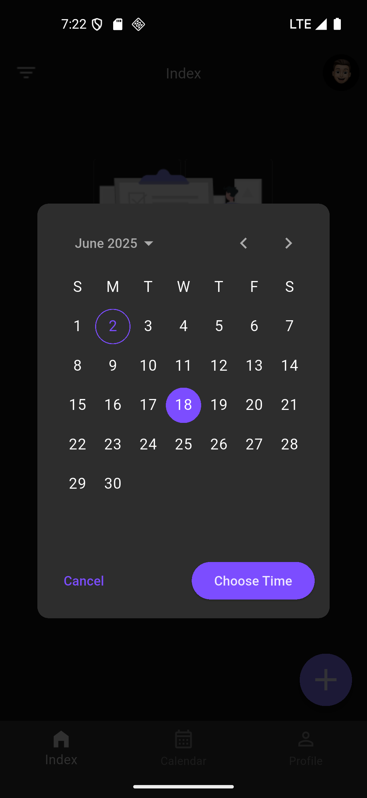
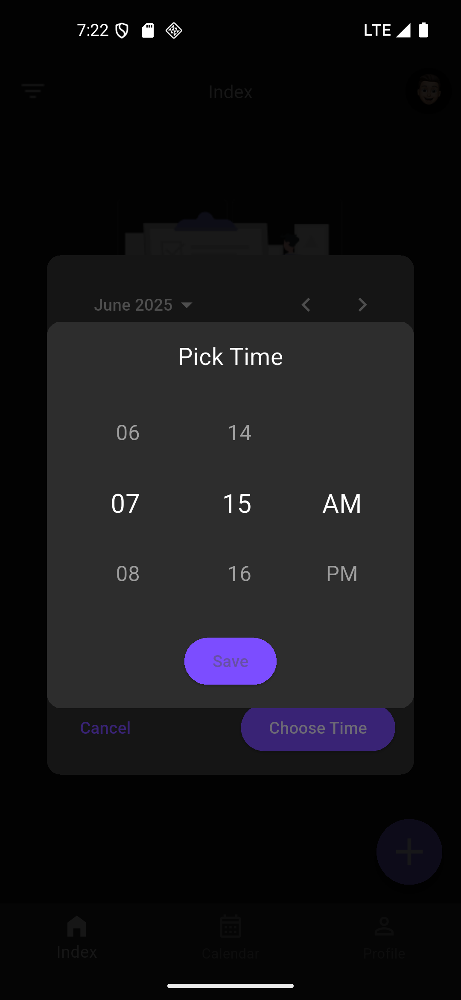

# TO DO APP
- A nice application for recording tasks and arranging them according to priority.
---
## Screenshot














---
## Tech Stack
- Flutter
- Dart
---
## Installation
1. Clone the repository:
```bash
git clone https://github.com/Ahmed-Almansour99/To-Do-App.git

cd To-Do-App

cd to_do_app

flutter pub get

flutter run
```
## Author

github : Ahmed-Almansour99
 

