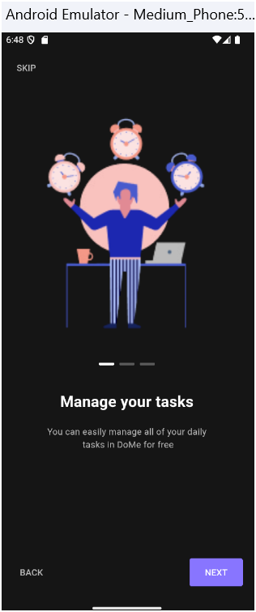
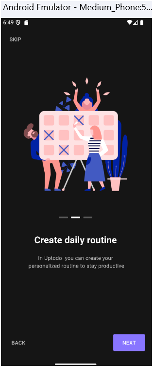
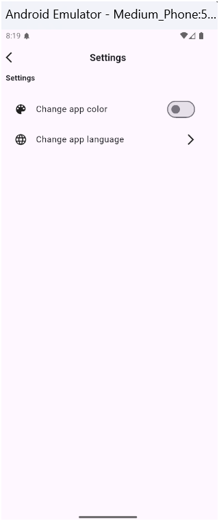
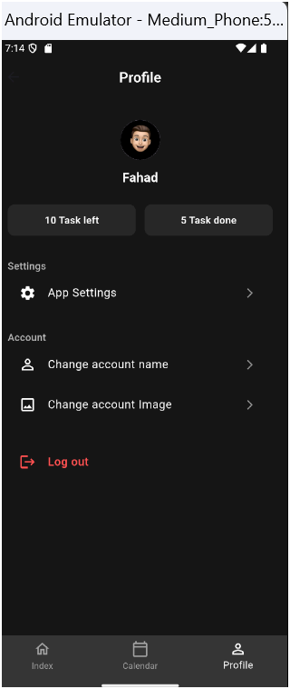

# 📝 To-Do App Development
## Overview
This project is a To-Do application developed using Flutter. It allows users to manage their tasks, set reminders, and organize their daily activities effectively. The application features a clean and modern user interface, providing an intuitive experience for users.

## Features
User Authentication:

Users can register and log in to their accounts.
The app supports user account management, including profile updates.

Task Management:

Users can create, edit, and delete tasks.
Tasks can have titles, descriptions, due dates, categories, and priority levels.
Completed tasks can be marked and filtered.

Calendar Integration:

A calendar view to visualize tasks based on due dates.
Users can toggle between viewing today's tasks and completed tasks.
<<<<<<< HEAD

Category Management:

Users can create and customize categories for better organization.
Categories can have specific icons and colors for easy identification.

Onboarding Experience:

A welcoming onboarding screen to guide new users through the app features.
Users can skip the onboarding process if they are familiar with the app.

Responsive Design:

The app is designed to be responsive and works well on various screen sizes.

State Management:

The application uses the BLoC (Business Logic Component) pattern to manage state efficiently.

Dark Mode:

The app features a dark theme, providing a visually appealing experience, especially in low-light environments.

Technologies Used
Flutter: For building cross-platform mobile applications.
Dart: The programming language used for Flutter development.
BLoC: For state management.

## ⚙️ Setup Instructions

Clone the repository: Use the command line: git clone <Your Repository Path>

Install dependencies: Make sure you have Flutter installed. Then run: flutter pub get

Run the app: You can launch the app using: flutter run

Note: You need a working emulator or a connected real device

# 📱Screen Design Overview

## Splash Screen

=======
Category Management:

Users can create and customize categories for better organization.
Categories can have specific icons and colors for easy identification.

Onboarding Experience:

A welcoming onboarding screen to guide new users through the app features.
Users can skip the onboarding process if they are familiar with the app.

Responsive Design:

The app is designed to be responsive and works well on various screen sizes.

State Management:

The application uses the BLoC (Business Logic Component) pattern to manage state efficiently.

Dark Mode:

The app features a dark theme, providing a visually appealing experience, especially in low-light environments.

Technologies Used
Flutter: For building cross-platform mobile applications.
Dart: The programming language used for Flutter development.
BLoC: For state management.

## ⚙️ Setup Instructions

Clone the repository: Use the command line: git clone <Your Repository Path>

Install dependencies: Make sure you have Flutter installed. Then run: flutter pub get

Run the app: You can launch the app using: flutter run

Note: You need a working emulator or a connected real device

# 📱Screen Design Overview

## Splash Screen

>>>>>>> cdd6b355a4275f9c1fc6085dd11dcb1a41ec23ed
## Onboarding Screen

### Onboarding 1 Screen

###   Onboarding 2 Screen

###   Onboarding 3 Screen

## Started Screen

## Register  Screen 

## Login Screen

## Index Screen before added task

## Index Screen after added task
<<<<<<< HEAD

## berfor edit to the task

## After edited and added other task

## Dialog show deleted task with name

## After deleted task 

## Calendar Screen 

## After completed task Mark box to assigned to completed

## Profile Screen

## Settings Screen

## Support Dark & light Mode Also English & Arabic 
### Light Mode English

### Dark mode Arabic

## change account name Dialog

## After change account name

## Change Image BottomSheet

## After chnage Image

## Logout Confirmation

///////////////////////////////////////
=======

## berfor edit to the task

## After edited and added other task

## Dialog show deleted task with name

## After deleted task 

## Calendar Screen 

## Profile Screen

## Settings Screen

## change account name Dialog

## Change Image BottomSheet

>>>>>>> cdd6b355a4275f9c1fc6085dd11dcb1a41ec23ed
